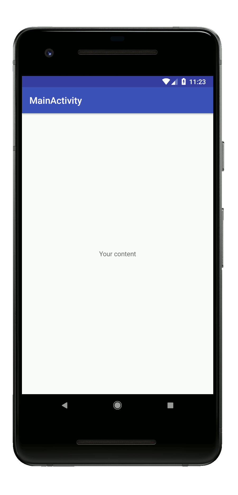

# Kunstmaan Shaker Menu

## Features
- [x] shake your phone to show a menu with custom entries




Example project integrating this in the Android build process can be found here []()

## Installation

in the `build.gradle` of your app, put:

```groovy
implementation 'be.kunstmaan.shakermenu'
// implementationDebug if needed only for debugging purposes
```

## Usage

- initialize ShakerMenu:

In your Application class add the following:

```java
new KunstmaanShakerMenu.Builder(application)
    .setTitle("My menu")
    .setSensitivity(KunstmaanShakerMenu.Sensitivity.LIGHT)
    .addItem("Title A", new Runnable() {
                        @Override
                        public void run() {
                            // put your code here
                        }
                    })
    .addItem("Title B", new Runnable() {
                        @Override
                        public void run() {13
                            // put your code here
                        }
                    })
    .build();
```

## Credits

`https://github.com/square/seismic` is used for the shaking detection, in compliance with the Apache License, Version 2.0.